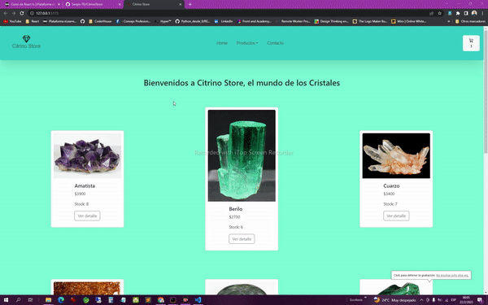

# Proyecto Final curso **_React JS_**
## Coderhouse
### Comisión 39555
---
#### Alumno: **_Torres Guaymasi Sergio_**
#### Proyecto: Tienda de Cristales, Gemas y Piedras.
#### Lenguajes utilizados y Framework: HTML, React JS, CSS
#### Base de Datos: Firebase
#### Librerias: 
*Sweet Alert
*React Icons
*Bootstrap 5
### El ecommerce permite a los visitantes poder realizar la compra de los productos ofrecidos con la opción de seleccionar las categorías, verificar el stock, detalle, precios y finalizar su recorrido al agregar los items deseados al carrito para procesar el pedido.

***_Gif mostrando la interactividad de la tienda_***

## Para iniciar el proyecto:
~~~
Npm run dev
~~~

